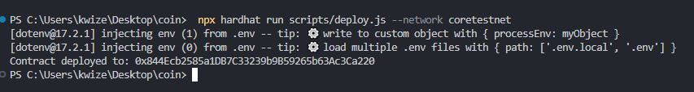
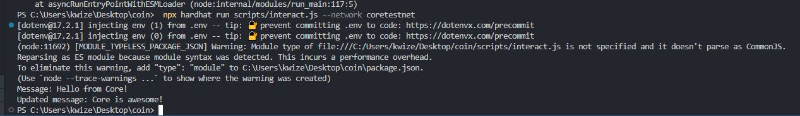
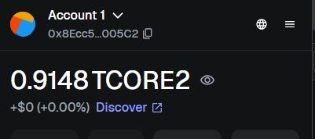

# HelloCore Hardhat Project

This is my first sample smart contract, built using Solidity and Hardhat. It is set up for compiling, testing, and deploying. Some of the contracts included are: `` HelloCore.sol ``

## steps to follow

* Install packages
    ```
    npm install
    ```
* Create .env file on the root directory level of your system
* Past your account private key
    ```shell
    touch .env
    ```
## Environment variables(env)
```
PRIVATE_KEY=5a4f**************************************************************
```

### Run compile command
```
    npx hardhat compile
```


### Running deployment script

```
npx hardhat run scripts/deploy.js --network coretestnet
```

## Images showing the output






